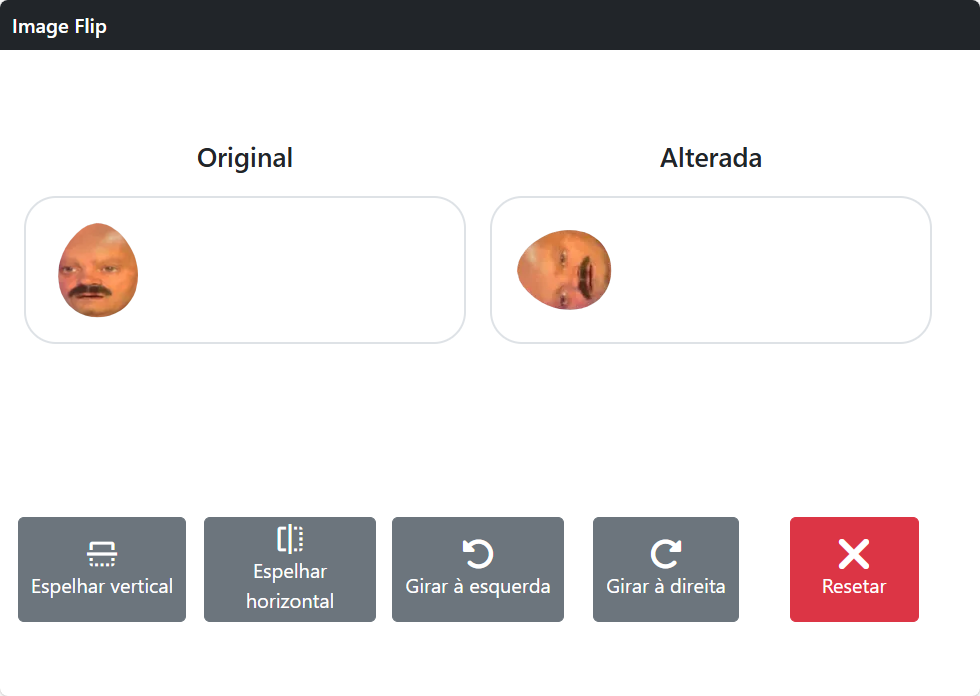

# Image Fliper

## Descrição
Esta é uma aplicação web que permite o upload de imagens e realiza operações de espelhamento e rotação nas mesmas. O frontend é desenvolvido com [Vue.js](https://vuejs.org/) e o backend utiliza [FastAPI](https://fastapi.tiangolo.com/).

## Funcionalidades
- Upload de imagens
- Espelhamento vertical e horizontal
- Rotação para a esquerda e direita
- Resetar a imagem para o estado original

## Capturas de Tela

## Tecnologias Utilizadas
- **Frontend:** Vue.js
- **Backend:** FastAPI (Python)
- **Outros:** HTML, CSS, JavaScript